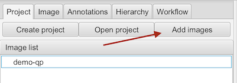
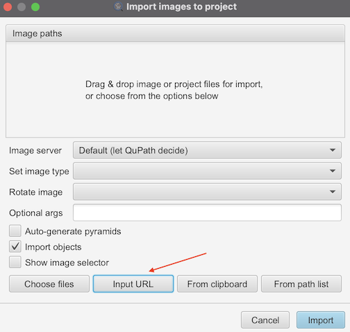
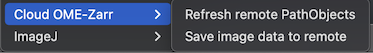

# qupath-ext-cloud-omezarr
QuPath extension to load OME-Zarr images from cloud storage

## Instructions

1. Log in to gcloud. You will need to do this regularly, depending on your credential expiration policies.

   `gcloud auth application-default login`

   Make sure to restart QuPath after logging in.

2. Download the extension JAR from …

3. Drag and drop the JAR onto QuPath.

4. Restart QuPath.

You can now add remote images to your QuPath project.

1. Create a new project, or open an existing one.

2. Add a new image using the project button.

   

3. Add the image by URL.

   

   1. For example, enter something like: `gs://my-bucket/my-data/images/LuCa-7color.zarr`

4. To load annotations, check "Import Objects" then set the optional args to `--qpdata-path <your qpdata file`

   1. For example, something like: `--qpdata-path gs://my-bucket/my-data/annotations/LuCa-7color/data.qpdata`

5. Add annotations, then save to cloud.

6. Load the annotations elsewhere:

   1. Repeat this process in another project (or simply copy the project file).
   2. If necessary, click "Refresh remote PathObjects" in the extension menu.


If you get any errors, please check the logs and report here. Auth errors are common if your login tokens expire after 24 hours, as is common in some enterprise environments.

## Demo

The extension is currently capable of reading an OME-Zarr file (as output by bioformats2raw spec version 0.4). Here is a demo showing the LuCa7 file [described here](src/test/resources/test.zarr/README.md):


Once you have created some annotations, you can save them to the cloud. You can also refresh your local copy from the cloud.



## Warning: experimental extension

⚠️ Use this extension at your own risk ⚠️
Its API & behavior are likely to change.

Known issues:

* If you save to the cloud, it will replace whatever's there without question.
* If you load from the cloud, it won't detect 
* The extension has no concept of which annotations have/haven't changed, it saves/loads everything.
* Adding `gs://bucket/file.zarr` image URIs doesn't work on Windows.
* Auth failures are not displayed very intuitively, you need to read through the logs.

## Why an extension?

Our data is cloud-based, and traditional file system bridges (like cloud NFS) are non-performant or very expensive. Cloud viewers exist (like [Avivator](https://avivator.gehlenborglab.org/), part of [Viv](https://github.com/hms-dbmi/viv)) but are view-only: no support for annotations.

The OME-NGFF aka OME-Zarr format is a natural choice for scalable cloud access. Clients can download just the chunks they need, at the level of detail (aka resolution / downsampling) they need.

Our primary user profile is a bioinformatician who is very familiar with QuPath, and does most of their work using QuPath (tools, scripting, etc.). It would be a lot of work to develop & maintain a QuPath replacement, with no benefit other than cloud compatibility.

QuPath has a rich extension framework; for example the [OMERO integration](https://github.com/qupath/qupath-extension-omero-web/) is an extension as is the support for the [BioFormats plugin](https://github.com/petebankhead/qupath/blob/acdbce962813b9edfd72e3d0384b4213d8ee89ce/qupath-extension-bioformats/src/main/java/qupath/lib/images/servers/bioformats/BioFormatsImageServer.java).

The [ZarrReader BioFormats extension](https://github.com/ome/ZarrReader) support OME-Zarr, but is S3 only, and has a longer release cycle. Furthermore, we don't need the full BioFormats complexity, at least not yet while we prove out cloud annotations. As an example of the complexity going between BioFormats and QuPath, see this [PR addressing optimal tile size](https://github.com/qupath/qupath/pull/1645).

As we build & test our cloud-first solution, we need:

1. a simple release cycle
2. direct, low(-ish) level access to the data (mostly for scale optimization)

A QuPath extension seems like the perfect fit.

## Build instructions

You should be able to build the extension like a usual gradle project.

```sh
./gradlew shadowJar
```

You can run the tests like so:

```sh
./gradlew cleanTest test
```

### Binary compatibility note

The extension relies on native C-Blosc binaries from the [QuPath project](https://github.com/qupath/c-blosc-jars). It should work for these architectures: Windows-x86-64, Linux-x86-64, Linux-aarch64, Mac-x86-64, and Mac-aarch64.

## Runtime instructions

See binary compatibility note above.

As of 2025-04-30, the built-in binary dependencies have only been tested on Mac-aarch64 (David's laptop).

